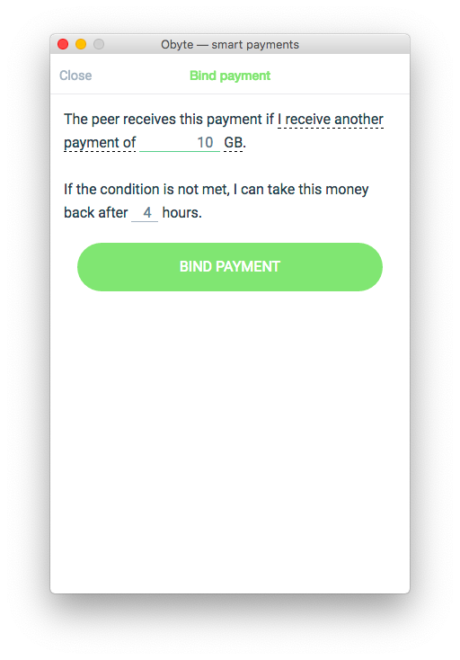
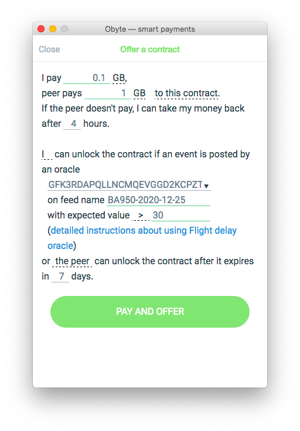
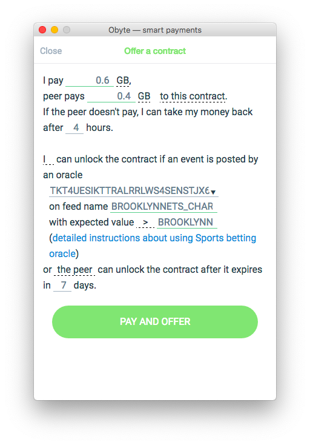

# Applications

This is where you can use Obyte already today.

## Create and issue stablecoins
Use [orable.org](https://ostable.org) website to issue stablecoins pegged to USD or BTC, or create new stablecoins pegged to any other asset or index.

These stablecoins appreciate in value, you can earn interest by holding them.

You can also trade one stablecoin against another stablecoin if you know where the price will go.
[image]

## Trade
Use [ODEX decentralized exchange](https://odex.ooo) or [Oswap automated market maker](https://oswap.io) to trade tokens issued on Obyte against each other.

ODEX uses off-chain order matching and is as fast as a centralized exchange.

Oswap allows to provide liquidity and earn fees from every trade.
[image]

## Risk-free conditional payments
Obyte allows you to do something that traditional currencies can't: [conditional payments](https://medium.com/obyte/making-p2p-great-again-fe9e20546a4a).

You set a condition when the payee receives the money. If the condition is not met, you get your money back.

For example, you want to exchange 100 A-tokens for 10 B-tokens. You send 100 A-tokens to the peer and set a condition "the peer can receive A-tokens only once I receive 10 B-tokens". The A-tokens are temporarily locked on a smart contract that exists between you and the peer, and the peer can't take A-tokens before he fulfils his part of the deal. He sends B-tokens to you, then he is able to unlock A-tokens from the contract.

## Secure donations
[PolloPollo](https://pollopollo.org) allows to donate directly to people in need and be confident that your donation reaches the destination.

Your money is locked on a smart contract, and it gets unlocked to the producer as soon as the recipient confirms the receipt of the product. The recipients are not exposed to crypto, they only receive a product for free while the producers are paid by donors.

[image]

## P2P insurance
You can hedge against negative events if you find a peer who is willing to bet on the event _not_ happening.

Insurance is just a simple smart contract that can be unlocked by the insured — if the event in question did occur, or by the insurer — otherwise.

Creating a contract is available in Obyte wallet, no programming skills are required. Chat with the peer, click his address in chat, select "offer a contract", and fill a form. This is what human-readable/human-writable smart contract looks like. The peer will be able to view the contract and accept it with one click.

If you want to buy flight delay insurance from a bot, find the corresponding bot in the Bot Store in the wallet and the bot will guide you through the process of smart contract creation.

Learn more about [P2P insurance](https://medium.com/obyte/making-p2p-great-again-episode-iv-p2p-insurance-cbbd1e59d527).

## Prediction markets
Make money by correctly predicting future events.

You bet that a specific event will happen, your peer bets on the event not happening. You can make P2P bets on e.g. price movements, sports, weather, or political events.

Like in P2P insurance above, create a human-readable/human-writable smart contract in your wallet and offer it to the peer.

If you want to bet against a bot, find Sports betting bot in the Bot Store in your wallet and browse the upcoming sports events. You can also be a bookmaker and create bets for others to accept.

## ICO Platform
* The only ICO platform on the market that offers a compliant sale of security tokens out of the box.
* Sell unregistered securities to accredited investors using built-in investor accreditation.
* Optionally require KYC using the built-in [real name verification](/platform/identity).
* Sell for Bytes, BTC, ETH.
* Display stats in real time.

Learn more about [launching an ICO](https://ico-platform.obyte.org) on Obyte platform.

[image]
