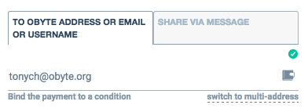

# Textcoins

Textcoins are a way to send cryptocurrency via email, chat, or any other text based media.

The sender doesn't need to know the recipient's Obyte address, they send money to an address they know such as email address or chat contact. It is even possible that the recipient doesn't have an Obyte wallet yet. In this case, the recipient will be prompted to install it in order to claim the received funds.

## What textcoins look like

Textcoins look like a sequence of 12 seemingly random words, for example:
```sh
together-orange-pelican-tooth-fox-lucky-half-cup-window-coil-radar-pen
```
These secret words, which are known only to the sender and the recipient, hold the key to a temporary Obyte address where the funds are stored. Sending a textcoin is like passing the key to a safe that stores a treasure.

## How to send payment in textcoins
The sender just types the recipient's email address instead of Obyte address when sending funds from their Obyte wallet. A textcoin will be generated and sent via email. Or, the sender can select "share via message" in their wallet and select a chat app to send through, such as WhatsApp, Telegram, WeChat, iMessage, etc. Or, the sender can print the 12 secret words on paper and send them by snail mail, pigeon post, or a time capsule.


## How to receive payment in textcoins
Textcoins are usually delivered as clickable links that hold the 12 secret words. In this case, the recipient's wallet automatically transfers funds from the textcoin temporary address to a recipien't own address when the link is clicked. If delivered as plain 12 secret words, the recipient can manually claim funds by entering the words in their wallet.

If the recipient doesn't claim the funds, the sender can claim them back, so the money is not lost.
