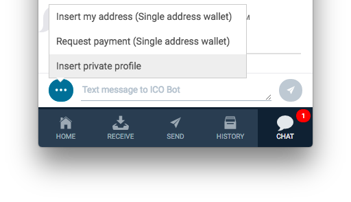
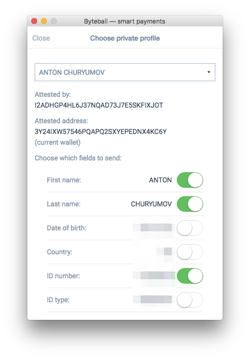

# Self-Sovereign Identity

On Obyte, users have an option to get any information about themselves verified and easily proven to third parties.

For example, a user may opt to have their real name verified, with the personal information being stored in their wallet and nowhere else, then share this information with other users they choose, with other users being able to verify that this information is authentic using the Obyte DAG.

Knowledge of a user's real-world identity might be necessary e.g. for signing [prosaic contracts](/platform/prosaic-contracts) to know that the other party really is who they say they are, or for some apps to be compliant with KYC requirements or to prevent fraud.

When sharing private information with their counterparts, users have full control of what they share. For example, having verified a government issued ID that contains one's real name, ID number, date of birth, and expiry date, one can choose to share only the date of birth with an app that needs only to verify the user's age in order to allow access to age restricted goods or services.

Other information, such as email address or social media profiles, can also be verified and shared with apps that need it. Users can also choose to have this information stored publicly on the DAG.

## How it works

Verification is performed by attestors &mdash; users or businesses trusted by both the user being verified and the relying party (one who needs to know certain information about the user, and know that it is authentic). 

After a successful verification, the attestor posts an attestation record to the Obyte DAG. This record contains the verified information about the user if the user chose to have it public, or a hash of this information, which makes it impossible for third parties to see the information but proves that it exists. In the latter case, the verified information is also saved privately in the user's wallet, so the user can later share it with interested parties. After this, the verified information can be used independently of the attestor, even if the attestor goes out of business.

If the verified information is saved privately in the user's wallet, the user can easily share it with interested parties using the built-in chat:

while choosing which fields to disclose:

## Available attestors
Verifications are usually performed by bots. Here are a few bots whose attestations can be used now:
* [Real name attestation bot](https://medium.com/obyte/bringing-identity-to-crypto-b35964feee8e): verifies user's government issued ID. Information extracted from the ID (name, ID number, country, date of birth, expiry date) is saved in the user's wallet while a hash of this information is posted to the DAG.
* [Email attestation bot](https://medium.com/obyte/distribution-to-verified-emails-and-sending-cryptocurrency-to-email-episode-ii-cb955fe19d7e): verifies user's email address. Users can opt to have their verified email published to the DAG or saved privately in the user's wallet. If a user chose to have their email published, this enables other users to send payments to the attested user by typing his/her email address instead of Obyte address.
* [Accredited investor attestation bot](https://medium.com/obyte/attestation-of-accredited-investors-d4a8dabf683b): verifies that the user qualifies as accredited investor according to the US law and SEC rules. This status enables the user to participate in Security Token Offerings (STOs).
* [Steem attestation bot](https://medium.com/obyte/introducing-a-bridge-between-byteball-and-steem-and-an-airdrop-548d7958b9e9): verifies that a user has a Steem account and optionally publishes the user's Steem username and reputation. Applications may choose to offer some privileges to users with high Steem reputation. If the Steem username is published, this enables other users to send payments to the attested user by typing "steem/username" instead of Obyte address.

Attestations can also be easily done manually by sending an attestation transaction from the attestor's wallet.

Developers, see the documentation about [working with attestations in your bots](https://developer.obyte.org/private-profiles), [checking for attestations in smart contracts](https://developer.obyte.org/contracts/reference#attested), and [reading the attested data in Autonomous Agents](https://developer.obyte.org/autonomous-agents/oscript-language-reference#attestation).