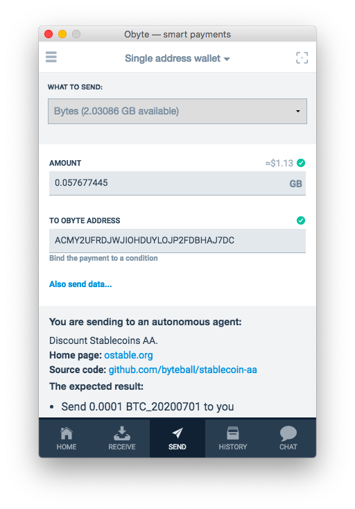

# Autonomous Agents

Autonomous Agents are programs that run on the DAG and allow to orchestrate a programmed, strictly rules-based flow and custody of assets, free from any human intervention.

AAs are most useful for creating **decentralized finance (DeFi)** apps where complete certainty about their performance is of utmost importance.

Decentralized applications (dApps) that can be powered by AAs include:
* tradable shares in prediction markets;
* futures contracts;
* algorithmic stable coins;
* synthetic assets;
* other derivatives;
* collateralized lending;
* margin trading;
* decentralized exchange;
* decentralized oracles;
* payment channels;
* game economies;
* market makers;
* automatic management of investment portfolios;

## Why DAG matters
Unlike blockchains, there are no miners or other intermediaries on DAG, therefore there is no room for miner manipulation. One doesn't need to bother about front-running or censorship by miners. Therefore, dApps running on a DAG are safer than dApps on blockchain.

## How Autonomous Agents work
Autonomous Agents are similar to vending machines. One sends a transaction with some money and data to an AA and expects a response: some other monetary token and some data permanently recorded on the DAG - similar to inserting coins into a vending machine, entering the number of the desired drink on a keypad, and getting the drink in response. [image that features a vending machine]

## Agents, not contracts
Autonomous Agents exist on equal terms with human actors: they are _endpoints_ of interactions. Contracts, on the other hand, exist _between_ humans or human-managed organizations, contracts _are_ interactions. [image: a network of interconnected nodes, most of them are humans, some are AAs]

Unlike humans though, AAs are governed by immutable code, not by free will.

## Transparency
Before actually sending any money or command to an AA, one can see the expected response of the AA.

## Developers: build your AAs
AAs are written in Oscript &mdash; a new programming language designed for this purpose. Oscript avoids some unsafe programming patterns common in earlier languages such as Solidity. It is easier to see what an AA is going to do, it is harder to make mistakes that would cost millions. Programming in Oscript is safer. Oscript syntax is easy to learn and will look familiar to those developers who have experience in JavaScript, PHP, Java, and SQL.

### Developer tools:
* [Oscript Editor](https://oscript.org): a browser based editor for Oscript, it allows to write AA code in the browser, no installation required, and immediately deploy using Obyte wallet. The editor includes a few templates of AAs to start with.
* [Visual Studio Code plugin for Oscript](https://marketplace.visualstudio.com/items?itemName=obyte.oscript-vscode-plugin) also allows to edit and deploy, plus it includes a testkit for running tests.
* [AA Testkit](https://github.com/valyakin/aa-testkit) for running tests and making sure your AA operates correctly in various scenarios of its usage.

See the full [developer documentation about Autonomous Agents](https://developer.obyte.org/autonomous-agents).

## Try AAs now
Some existing AAs:
* [Discount Stablecoins](https://ostable.org): issue or redeem stablecoins pegged to any asset or index, or launch a new stablecoin.
* [ODEX decentralized exchange](https://odex.ooo): trade any tokens issued on Obyte with fast order execution, user experience is similar to that of centralized exchanges.
* [Oswap automated market maker](https://oswap.io): quickly exchange one token for another in just a few clicks.
* **Decentralized token registry** (it has no UI yet, one has to send command directly to the AA) to assign ticker symbols to tokens on Obyte.

