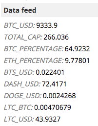

# Oracles

Oracles are providers of data on the ledger. This data can be referenced from [smart contracts](platform/smart-contracts) or [autonomous agents](platform/autonomous-agents) and the resolution of smart contracts or behavior of AAs can depend on the data.

For example, in conditional payments, the release of payment can be conditioned by confirmation of some event having been posted by an oracle. In a sports betting contract, an oracle posts the result of a game and the party who correctly predicted the outcome wins the money locked on the contract. In a flight delay insurance contract, an oracle posts the delay of a particular flight and if it is above some threshold, the insured gets the money locked on the contract by the insurer.

In stablecoins and other synthetic assets that are created using Autonomous Agents, oracles are very important for providing accurate price data.



Oracles need to be trusted by both (or more) parties of a smart contract or by all users of an Autonomous Agent to provide true data because the performance of smart contracts and AAs depends on that data. That's why oracles are usually run by well known and reputable individuals or organizations. Where especially high level of assurance is required, smart contracts or AAs can reference several oracles.

## How oracles work
Oracles are bridges between the real world and the distributed ledger. They bring real-world data to the ledger, usually by reading some publicly accessible API and posting that data into the Obyte DAG. Data is posted as a data feed transaction. In Obyte, several types of transactions are possible, payment being the most popular one, and data feed is another type of transaction. The data feed is posted from the oracle address and can be easily found by this address and data feed name.

Oracles are usually automated and operate in one of three modes:
* Continuous posting of data. Such oracles post new data points periodically and do so on their own, without any requests for this data. This mode is suitable for data that is realtively small, easy to obtain, and frequently used, for example, price data. [Price oracle](https://explorer.obyte.org/#JPQKPRI5FMTQRJF4ZZMYZYDQVRD55OTC) works in this mode.
* Continuous posting of Merkle roots of large data sets. Like above, but the data set is so large and each data point used so infrequently that posting the whole data set would be impractical. Merkle path proving any particular data point can be provided by the oracle on demand or recontructed independently. This Merkle path can later be used in smart contracts or AAs. [Bitcoin oracle](https://explorer.obyte.org/#FOPUBEUPBC6YLIQDLKL6EW775BMV7YOH) works in this mode and it allows to prove that a particular transaction has occured on Bitcoin blockchain to enable safe peer-to-peer exchange. [Learn more about Bitcoin oracle](https://medium.com/obyte/making-p2p-great-again-episode-ii-bitcoin-exchange-d98adfbde2a5).
* Posting data on demand. This type of oracle posts data only when requested to do so and this mode makes sense when the data is paid, too large, or infrequently used. Such oracle can also charge a fee for its service. Flight delays oracle and sports oracle work in this mode. [Learn more about flight delays oracle](https://medium.com/obyte/making-p2p-great-again-episode-iv-p2p-insurance-cbbd1e59d527).

Data can also be posted manually, Obyte wallet allows to easily do so. This makes sense for rare or one-off events.


## How to use oracle data
Once a data point is posted by an oracle, it is stored on the DAG indefinitely and can be freely read by smart contracts and Autonomous Agents using oracle address and data feed name.

Smart contracts that depend on oracle data can reference it like this:
```json
['in data feed', [ ['ORACLE_ADDRESS'], 'data feed name', '=', 'expected value'] ]
```
Autonomous Agents can read the latest data feed value like this:
```php
data_feed[[oracles=$oracle_address, feed_name=$data_feed_name]]
```

Developers, see the developer docs to learn more about [posting data feeds](https://developer.obyte.org/payments/data#key-value-data-feed), [using oracle data in smart contracts](https://developer.obyte.org/contracts/reference#in-data-feed), and [using oracle data in AAs](https://developer.obyte.org/autonomous-agents/oscript-language-reference#data_feed).