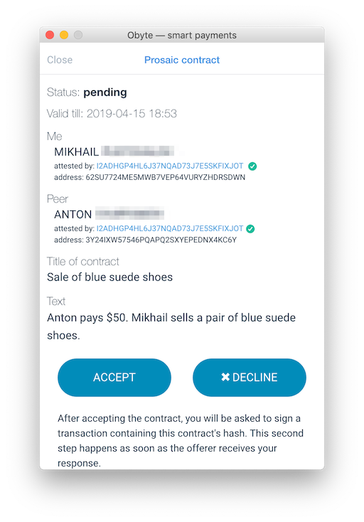

# Prosaic Contracts

Prosaic contracts are just regular contracts signed by two Obyte wallets. They make it easy for one party to compose and offer a contract to the other party, and for the other party to accept it in two clicks.

The two parties use chat in Obyte wallet to make offers, privately exchange the texts of the contracts, and singnal acceptance. The texts of the contracts are stored privately in the wallets of the parties, while a hash of the contract signed by the two parties is stored on Obyte DAG. Should a dispute arise, a thrird party (an arbitrator, mediator, judge) will be able to use this hash to verify that the contract was really signed by the two parties and that it was not altered after signing.

## Real names attached

Before signing a prosaic contract, the parties can (and are recommended to) exchange their [real world identities linked to their wallet addresses](identity) in order to prove who they are.

## Enforcement

Prosaic contracts do not lock any funds that could gurantee contract execution, they are not smart contracts. They have to be enforced like regular contracts, and the signatures created when signing prosaic contracts are classified as **advanced electronic signatures** under the European electronic signature regulation and similar laws of some other countries.

Smart contracts that do lock funds to guarantee contract execution and also have a prosaic part attached, are currently [being developed](https://medium.com/obyte/whats-next-for-obyte-contracts-with-arbiter-7e625e05811a).

## Developers: integrate prosaic contracts in your apps

The process of offering and acceptance of prosaic contracts can be automated using Obyte chatbots, see [developer documentation about prosaic contracts](https://developer.obyte.org/contracts/prosaic-contracts).

Learn more about prosaic contracts in our [introductory blog post](https://medium.com/obyte/introducing-prosaic-contracts-5d3564638a20).
