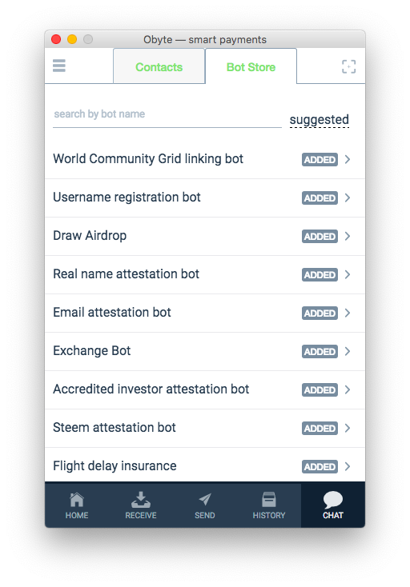

# Chat and chatbots

In Obyte, payments can be tightly integrated with communications &mdash; through chat.

Chat is built-in into Obyte wallet and allows to chat both with people and bots and instantly redirect the user to an action that requires the wallet functionality, such as sending a payment, sharing a private profile, signing a contract, etc.

In addition to the standard text messaging functionality, the chat supports:
* sending payments requests for a specific amount;
* paying the requested amount in two clicks;
* sharing one's address for easy use in payments and contracts;
* sending a payment to the peer's address in a few clicks;
* sharing one's [private profile](/platform/identity) or a part thereof;
* requesting a private profile;
* offering a menu of clickable commands for easy navigation;
* sending a vote;
* signing a message;
* requesting to sign a message;
* offering a [prosaic contract](/platform/prosaic-contracts);
* accepting a prosaic contract.

These capabilities are most useful for chatbots, which are small apps programmed to give automated responses depending on user input. 

For deveopers, chatbots offer a way to quickly create a simple app without large investment into UI. For end users, chatbots offer a way to quickly start using a new app without investing much time into learning a new user interface.

Chatbots can be added to the Bot Store which is also built-in in Obyte wallets and is similar to the App Store on iOS or Google Play on Android. The Bot Store enables easy discovery of apps by users and a channel of distribution for app developers.

Chat messages are end-to-end encrypted using user private keys, therefore, although the messages are relayed through a hub, the hub cannot see their cleartext content.

Developers, see the [documentation about chatbots](https://developer.obyte.org/#simple-chatbot) on our developer website.
